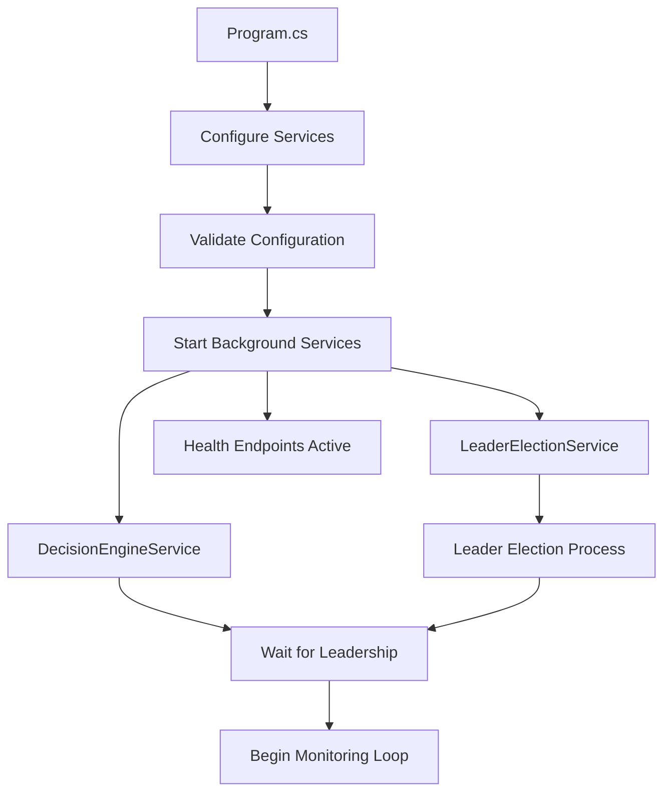
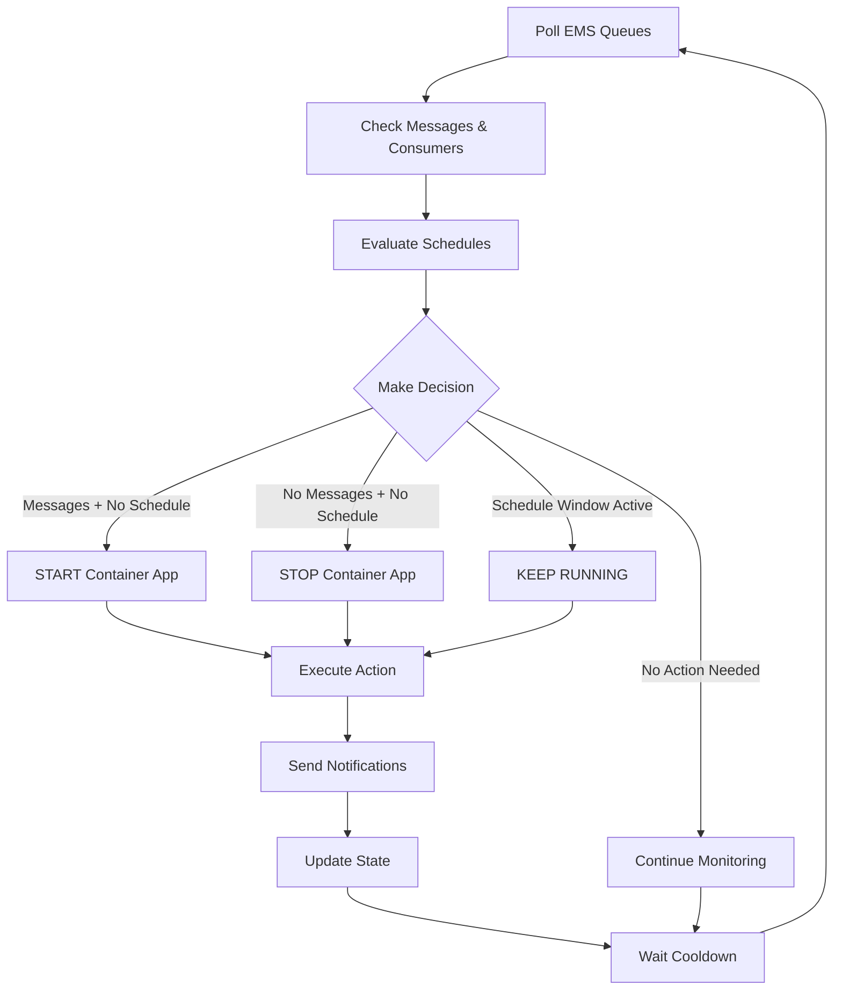

# 🏗️ ContainerApp Manager - Project Structure Analysis

**Complete architectural overview and file-by-file breakdown of the Azure Container Apps auto-scaling solution.**

---

## 📋 **Table of Contents**

- [Overall Architecture](#-overall-architecture)
- [Directory Structure](#️-directory-structure)
- [Root Level Files](#-root-level-files)
- [Development & CI/CD](#️-development--cicd)
- [Source Code Structure](#-source-code-structure)
- [Application Flow](#-application-flow)
- [File Reference Matrix](#-file-reference-matrix)

---

## 🏛️ **Overall Architecture**

This is a **.NET 8.0 Worker Service** that automatically scales **Azure Container Apps** based on **TIBCO EMS queue monitoring** and **scheduled policies**. It's designed as an enterprise-grade solution with leader election, state persistence, and comprehensive monitoring.

### **Key Architectural Patterns**
- **Background Service Pattern** - Long-running service with hosted service lifecycle
- **Leader Election Pattern** - Multi-replica safe with Azure Blob Storage coordination
- **State Management Pattern** - Persistent state via Azure Table Storage
- **Retry Pattern** - Polly-based resilience with exponential backoff
- **Observer Pattern** - Queue monitoring with event-driven scaling decisions
- **Strategy Pattern** - Pluggable scaling strategies (queue-driven vs schedule-driven)

---

## 🗂️ **Directory Structure**

```
ContainerApp.Manager/
├── 📄 Documentation & Configuration
│   ├── README.md                          # Project overview & features
│   ├── GETTING-STARTED.md                 # 5-minute quick start
│   ├── PROJECT-STRUCTURE.md               # This file - architecture analysis
│   ├── CLAUDE.md                          # Technical guidance & commands
│   ├── TIBCO-ADMIN-SETUP.md              # TIBCO EMS Admin API setup
│   ├── DEBUG-SETUP.md                     # Docker debug environment
│   ├── .env.example                       # Environment variables template
│   └── .gitignore                         # Git exclusions (team-optimized)
│
├── 🐳 Containerization & Deployment  
│   ├── Dockerfile                         # Production container build
│   ├── docker-compose.debug.yml           # Debug environment stack
│   └── deploy/                            # (Infrastructure as Code)
│
├── ⚙️ Development Environment
│   ├── .vscode/                           # VS Code team settings
│   │   ├── settings.json                  # Editor & formatting config
│   │   ├── launch.json                    # Debug configurations
│   │   ├── tasks.json                     # Build & run tasks
│   │   └── extensions.json                # Recommended extensions
│   └── .github/workflows/                 # CI/CD pipeline
│       └── ci-cd.yml                      # Build, test, deploy automation
│
├── 🧪 Debug & Testing
│   └── debug/
│       ├── azure-mock/                    # Mock Azure services
│       │   └── azure-mock-expectations.json
│       └── ems-config/                    # TIBCO EMS test setup
│           └── ems-init.json
│
└── 💻 Source Code
    ├── ContainerApp.Manager.sln           # Solution file
    └── src/ContainerApp.Manager/
        ├── Program.cs                      # 🚀 Application bootstrap
        ├── Worker.cs                       # Background service host
        ├── ContainerApp.Manager.csproj     # Project dependencies
        │
        ├── ⚙️ Configuration
        │   ├── Config/
        │   │   ├── MonitorOptions.cs       # Main configuration model
        │   │   └── EmsOptions.cs           # TIBCO EMS settings
        │   ├── appsettings.json            # Production config template
        │   ├── appsettings.Development.json # Your dev secrets (gitignored)
        │   └── appsettings.Debug.json      # Docker debug config
        │
        ├── 🎯 Core Logic
        │   └── Control/
        │       ├── DecisionEngineService.cs # ⭐ MAIN ORCHESTRATOR
        │       └── ActionExecutorService.cs # Scaling action executor
        │
        ├── 🔌 External Integrations  
        │   ├── Ems/
        │   │   └── EmsClient.cs            # TIBCO EMS interface
        │   ├── Azure/
        │   │   └── ContainerAppManager.cs   # Azure Container Apps API
        │   └── Notifications/
        │       └── NotificationService.cs   # Email alerts system
        │
        ├── 📊 Support Services
        │   ├── Scheduling/
        │   │   ├── ScheduleEvaluator.cs    # Cron schedule evaluation
        │   │   └── SchedulerService.cs     # Quartz.NET integration
        │   └── State/
        │       ├── LeaderElectionService.cs # Multi-replica coordination
        │       └── StateStore.cs           # Azure Table persistence
        │
        ├── 🔧 Infrastructure
        │   ├── Properties/
        │   │   └── launchSettings.json     # Dev/Debug launch profiles
        │   └── libs/tibco/                 # Manual TIBCO DLLs
        │       └── README.md               # DLL installation guide
        │
        └── Templates/ (gitignored, created by team)
            └── appsettings.Development.json.template # Config template
```

---

## 📄 **Root Level Files**

### **📚 Documentation Files**

| File | Purpose | Target Audience |
|------|---------|-----------------|
| **README.md** | Complete project overview with features, installation, configuration examples | End users, DevOps engineers |
| **GETTING-STARTED.md** | 5-minute quick start guide with validation checklist | New team members |
| **PROJECT-STRUCTURE.md** | This file - comprehensive architecture analysis | Developers, architects |
| **CLAUDE.md** | Technical guidance, minimal-diff policy, development commands | Development team |
| **TIBCO-ADMIN-SETUP.md** | TIBCO EMS Admin API setup with DLL installation | TIBCO administrators |
| **DEBUG-SETUP.md** | Docker debug environment and advanced debugging | Developers |

### **⚙️ Configuration Files**

| File | Purpose | Contains |
|------|---------|----------|
| **.env.example** | Environment variables template | Azure connection strings, TIBCO credentials, debug settings |
| **.gitignore** | Git exclusions (team-optimized) | Build artifacts, secrets, user-specific files |
| **ContainerApp.Manager.sln** | Visual Studio solution | Single project reference with build configurations |

### **🐳 Containerization Files**

| File | Purpose | Features |
|------|---------|----------|
| **Dockerfile** | Production container build | Multi-stage build, .NET 8.0, manual TIBCO DLL support |
| **docker-compose.debug.yml** | Complete debug environment | Azurite, TIBCO EMS, Azure mocks, networking |

---

## ⚙️ **Development & CI/CD**

### **🔧 Visual Studio Code Integration** (`.vscode/`)

| File | Function | Benefits |
|------|----------|----------|
| **settings.json** | Team editor settings | Consistent formatting, .NET config, file associations |
| **launch.json** | Debug configurations | F5 debugging for Dev/Debug profiles |
| **tasks.json** | Build & automation tasks | Build, clean, format, Docker operations |
| **extensions.json** | Recommended extensions | .NET, Azure, Docker, Git tooling |

### **🚀 CI/CD Pipeline** (`.github/workflows/`)

| File | Function | Stages |
|------|----------|---------|
| **ci-cd.yml** | GitHub Actions pipeline | Build → Test → Containerize → Deploy to Azure |

### **🧪 Debug Environment** (`debug/`)

| File | Function | Provides |
|------|----------|----------|
| **azure-mock-expectations.json** | Mock Azure services | Communication Services, Key Vault responses |
| **ems-init.json** | TIBCO EMS configuration | Pre-created test queues, admin setup |

---

## 💻 **Source Code Structure**

### **🚀 Application Bootstrap**

#### **Program.cs** - Dependency Injection & Service Configuration
```csharp
// Key responsibilities:
- Azure service clients (Storage, Communication, Key Vault)
- Dependency injection container setup  
- Configuration validation (MonitorOptions, EmsOptions)
- OpenTelemetry observability configuration
- Background service registration
- Health endpoint setup (/health/live, /health/ready)
```

#### **Worker.cs** - Background Service Framework
```csharp  
// Minimal implementation:
- Provides BackgroundService base class
- Currently placeholder for service hosting
- Could be extended for additional background tasks
```

---

### **⚙️ Configuration Models**

#### **Config/MonitorOptions.cs** - Core Configuration
```csharp
public class MonitorOptions
{
    int PollIntervalSeconds;           // Queue polling frequency
    int CooldownMinutes;              // Scaling throttle prevention
    List<AppMapping> Mappings;        // Container App → Queue mappings
    MessageProcessingAlerts Alerts;   // Long processing notifications
}

public class AppMapping  
{
    string ResourceGroup, ContainerApp;     // Azure resource identifiers
    int DesiredReplicas;                    // Target scale size
    List<string> Queues;                    // EMS queues to monitor
    List<ScheduleWindow> Schedules;         // Time-based scaling windows
    
    // v2.0 Retry mechanism
    int MaxRestartAttempts;                 // Failure retry limit
    int RestartCooldownMinutes;             // Retry throttling
    int ConsumerTimeoutMinutes;             // Consumer detection timeout
    int StartupGracePeriodMinutes;          // App initialization window
}
```

#### **Config/EmsOptions.cs** - TIBCO EMS Integration
```csharp
public class EmsOptions
{
    // Basic Connection
    string ConnectionString, Username, Password;
    int ConnectionTimeoutMs, ReconnectDelayMs;
    
    // Enhanced Admin API (v2.0)
    string AdminUsername, AdminPassword;    // Admin API credentials
    bool UseAdminAPI;                      // Enable enhanced monitoring
    bool FallbackToBasicMode;              // Graceful degradation
}
```

---

### **🎯 Core Control Logic**

#### **Control/DecisionEngineService.cs** - ⭐ **MAIN ORCHESTRATOR**
```csharp
// PRIMARY SCALING BRAIN - Makes all scaling decisions
public class DecisionEngineService : BackgroundService
{
    // Core Logic Flow:
    1. Poll EMS queues for messages and consumers
    2. Evaluate current time against schedules  
    3. Make scaling decision using simple rules:
       - Messages present + No schedule window → START
       - No messages + No schedule window → STOP  
       - Schedule window active → KEEP RUNNING (protection)
    4. Execute scaling action via ActionExecutorService
    5. Update state and send notifications
    6. Wait for cooldown period
    
    // Key Features:
    - Leader election aware (only runs on leader)
    - Multi-queue coordination per container app
    - Schedule window protection (never stop during business hours)
    - Restart attempt tracking with exponential backoff
    - Long processing time detection and alerting
}
```

#### **Control/ActionExecutorService.cs** - Scaling Action Executor
```csharp
// Executes scaling decisions and handles notifications
- Calls Azure Container Apps Resource Manager APIs
- Implements retry logic with Polly resilience patterns
- Sends rich HTML email notifications with context
- Tracks action success/failure rates and history
- Handles ActionType.None for conflict notifications
```

---

### **🔌 External Integrations**

#### **Ems/EmsClient.cs** - TIBCO EMS Interface
```csharp
// Dual-mode EMS integration with enhanced Admin API support
public interface IEmsClient 
{
    // Basic mode - queue browsing
    Task<QueueObservation> ObserveQueueAsync();
    
    // Enhanced mode - Admin API (v2.0)  
    Task<EnhancedQueueObservation> ObserveQueueEnhancedAsync();
}

// Enhanced capabilities:
- Precise consumer counts (active vs total)
- Message age tracking and processing duration
- Real-time throughput statistics  
- Queue health metrics
- Graceful fallback to basic mode if Admin API unavailable
```

#### **Azure/ContainerAppManager.cs** - Azure Integration  
```csharp
// Azure Container Apps scaling via Resource Manager APIs
- Scale container apps up/down with replica management
- Azure authentication (Managed Identity + Service Principal)
- Container app status monitoring and health checks
- Resource allocation and constraint management
```

#### **Notifications/NotificationService.cs** - Alert System
```csharp
// Rich email notification system via Azure Communication Services
- Context-aware scaling event notifications
- Long processing alerts with graduated timing (20min, 25min, 30min+)
- Professional HTML email templates
- Retry attempt tracking and restart history inclusion
- Support team decision-making information (no automatic actions)
```

---

### **📊 Support Services**

#### **Scheduling/** - Time-Based Scaling
| File | Function |
|------|----------|
| **ScheduleEvaluator.cs** | Cron expression evaluation, schedule window detection |
| **SchedulerService.cs** | Quartz.NET integration, background job scheduling |

#### **State/** - Persistence & Coordination  
| File | Function |
|------|----------|
| **LeaderElectionService.cs** | **Leader election** via Azure Blob Storage leases |
| **StateStore.cs** | **State persistence** via Azure Table Storage |

---

## 🔄 **Application Flow**

### **🚀 Startup Sequence**


### **⚡ Main Decision Loop** (DecisionEngineService)


### **🎯 Key Decision Logic**
```csharp
// Simplified v2.0 scaling logic:
if (inScheduleWindow) 
{
    // Priority 1: Schedule protection - never stop during business hours
    return isRunning ? ScalingAction.None : ScalingAction.Start;
}

// Priority 2: Message-driven scaling (outside schedule windows)
if (hasMessages && !isRunning) return ScalingAction.Start;
if (!hasMessages && isRunning) return ScalingAction.Stop;

return ScalingAction.None;
```

---

## 📊 **File Reference Matrix**

### **📁 Configuration Files**
| File | Environment | Contains | Tracked in Git |
|------|-------------|----------|----------------|
| `appsettings.json` | Production template | Sample config, no secrets | ✅ Yes |
| `appsettings.Development.json` | Your local dev | Real secrets & connection strings | ❌ No (gitignored) |
| `appsettings.Debug.json` | Docker debug | Azurite & local EMS settings | ✅ Yes |
| `.env.example` | Template | Environment variable examples | ✅ Yes |
| `.env` | Your local | Real environment variables | ❌ No (gitignored) |

### **🔧 Core Service Dependencies**

| Service | Depends On | Provides To | Key Interface |
|---------|------------|-------------|---------------|
| **DecisionEngineService** | EmsClient, ContainerAppManager, StateStore | ActionExecutorService | Main orchestration |
| **ActionExecutorService** | ContainerAppManager, NotificationService | DecisionEngineService | Action execution |
| **EmsClient** | TIBCO EMS Server, Admin API | DecisionEngineService | Queue monitoring |
| **LeaderElectionService** | Azure Blob Storage | DecisionEngineService | Leader coordination |
| **StateStore** | Azure Table Storage | DecisionEngineService | State persistence |

### **🎯 Scaling Decision Matrix**

| Queue State | Consumer State | Schedule Active | Action | Reason |
|-------------|----------------|-----------------|--------|---------|
| Has Messages | No Consumers | No | **START** | Need processing power |
| Has Messages | Has Consumers | No | **NONE** | Already processing |
| No Messages | No Consumers | No | **NONE** | Nothing to do |
| No Messages | Has Consumers | No | **STOP** | No work, save resources |
| Any State | Any State | **Yes** | **KEEP RUNNING** | Schedule protection |

---

## 🎯 **Quick Navigation**

**🚀 Getting Started**: [GETTING-STARTED.md](GETTING-STARTED.md) - 5-minute setup  
**📖 Full Documentation**: [README.md](README.md) - Complete feature overview  
**⚙️ Technical Guidance**: [CLAUDE.md](CLAUDE.md) - Development commands  
**🐳 Debug Environment**: [DEBUG-SETUP.md](DEBUG-SETUP.md) - Advanced debugging  
**🔧 TIBCO Setup**: [TIBCO-ADMIN-SETUP.md](TIBCO-ADMIN-SETUP.md) - Admin API integration  

---

**💡 This architecture provides enterprise-grade reliability with comprehensive monitoring, state management, and fail-safe mechanisms for production Azure environments.**